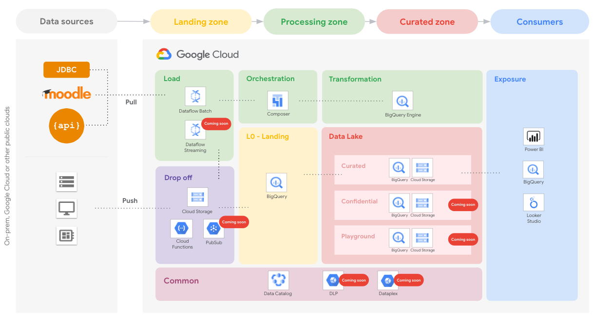

# Government Data Platform (GDP) — República Digital de Novatlantis

Esta implementação materializa o **Government Data Platform (GDP)** da República Digital de Novatlantis no projeto Google Cloud **`novatlantis`**, construído sobre a arquitetura de referência oficial do Google Cloud [**Education Data Platform (EDP)**](https://github.com/googlecloudplatform/education-data-platform) e integrado nativamente ao banco transacional **AlloyDB for PostgreSQL** (`novatlantis-sovereign-cluster`).

  

---

## 1. Arquitetura Fim-a-Fim (AlloyDB + BigQuery Medallion + Cloud Storage)

| Camada GDP / EDP | Recurso Provisionado em `novatlantis` | Finalidade Soberana |
| :--- | :--- | :--- |
| **OLTP Soberano (AlloyDB)** | Cluster `novatlantis-sovereign-cluster` / Instância `novatlantis-primary-01` (`us-central1`) | Banco transacional PostgreSQL 15 compatível com AlloyDB AI, Columnar Engine e `alloydb_scann` para os 100.000 cidadãos (`dim_citizens`, `user_credentials`, `citizen_profiles`, `fact_311_requests`, `fact_911_dispatches`, `fact_telemed_sessions`, `fact_edu_assessments`, `gov_iam_roles`). |
| **Drop-off Zone (`01-dropoff.tf`)** | Bucket `gs://novatlantis-gdp-drp-cs-0` Pub/Sub `novatlantis-gdp-drp-ps-0` Dataset `novatlantis_gdp_drp_bq_0` | Zona de aterrissagem de eventos em tempo real dos portais governamentais, APIs REST e conectores educacionais/saúde. |
| **Load Zone (`02-load.tf`)** | Bucket `gs://novatlantis-gdp-load-cs-0` SA `gdp-load-df-0@novatlantis.iam.gserviceaccount.com` | Camada de ingestão Cloud Dataflow e carga em lote Parquet/NDJSON para o Data Warehouse. |
| **Transformation Zone (`04-transformation.tf`)** | Bucket `gs://novatlantis-gdp-trf-cs-0` SAs `gdp-trf-df-0` & `gdp-trf-bq-0` | Transformação SQL/Dataflow, anonimização SHA-256 e classificação de colunas via Cloud DLP / Data Catalog Policy Tags. |
| **DWH Landing (`05-datawarehouse.tf`)** | Dataset `novatlantis.novatlantis_gdp_dwh_lnd_bq_0` Bucket `gs://novatlantis-gdp-dwh-lnd-cs-0` | Dados brutos estruturados dos 100.000 cidadãos (`dim_citizens`) e tabelas operacionais sincronizadas do AlloyDB. |
| **DWH Curated (`05-datawarehouse.tf`)** | Dataset `novatlantis.novatlantis_gdp_dwh_cur_bq_0` Bucket `gs://novatlantis-gdp-dwh-cur-cs-0` | Tabelas anonimizadas (`citizen_360_anonymized`) e Views analíticas para Looker Studio (`v_mdl_users`, `v_mdl_courses`, `v_mdl_grades`, `v_gdp_executive_kpis`). |
| **DWH Confidential (`05-datawarehouse.tf`)** | Dataset `novatlantis.novatlantis_gdp_dwh_conf_bq_0` Bucket `gs://novatlantis-gdp-dwh-conf-cs-0` | Camada restrita contendo PII e templates biométricos NIST (`citizens_pii_biometrics`) protegida por Policy Tags (`3_Confidential`, `2_Private`, `1_Sensitive`). |
| **DWH Playground (`05-datawarehouse.tf`)** | Dataset `novatlantis.novatlantis_gdp_dwh_plg_bq_0` Bucket `gs://novatlantis-gdp-dwh-plg-cs-0` | Sandbox analítico para cientistas de dados governamentais e treinamento de agentes Vertex AI. |

---

## 2. Estrutura de Diretórios

- [`1-foundations/`](./1-foundations/README.md): Infraestrutura Terraform das zonas Drop-off, Load, Orchestration, Transformation, Data Warehouse (Landing, Curated, Confidential, Playground), Common (Data Catalog & DLP) e AlloyDB (`08-alloydb-sovereign.tf`).
- [`2-connector-moodle/`](./2-connector-moodle/README.md): Conector educacional para ingestão de escolas, cursos, alunos e notas escolares (`v_mdl_users`, `v_mdl_courses`, `v_mdl_grades`).
- [`3-connector-rest-apis/`](./3-connector-rest-apis/README.md): Conector de APIs REST governamentais (Portal Principal, Portal do Cidadão e Backstage Governamental).
- [`4-looker-dashboards/`](./4-looker-dashboards/docs/students-dashboards.md): Modelos e views analíticas conectadas ao Looker Studio.
- [`modules/`](./modules): Módulos Terraform reutilizáveis do Cloud Foundation Fabric.
